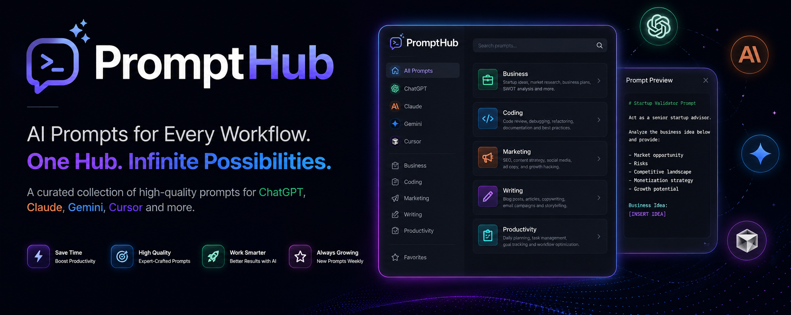

# PromptHub
A curated collection of high-quality AI prompts for ChatGPT, Claude, Gemini, Cursor, and other AI assistants

# PromptHub

<p align="center">
  
</p>

<h1 align="center">PromptHub</h1>

<p align="center">
  A curated collection of high-quality AI prompts for ChatGPT, Claude, Gemini, Cursor, and other AI assistants.
</p>

<p align="center">
  
  
  
  
  
</p>

---

## What is PromptHub?

PromptHub is a growing collection of carefully organized prompts designed to improve productivity, coding, content creation, business workflows, research, and AI-assisted development.

Instead of searching through forums and social media, find ready-to-use prompts in one place.

---

## Categories

### 💻 Coding

* Code Review
* Debugging
* Refactoring
* Documentation
* Architecture Planning

### 📈 Marketing

* SEO Strategy
* Ad Copy
* Landing Pages
* Email Campaigns
* Content Planning

### 💼 Business

* Startup Validation
* Market Research
* Competitor Analysis
* Business Plans
* Customer Discovery

### ✍️ Writing

* Blog Posts
* Articles
* Newsletters
* Social Media Content
* Copywriting

### 🚀 Productivity

* Daily Planning
* Goal Tracking
* Workflow Design
* Task Prioritization
* Meeting Summaries

---

## Supported AI Models

| Platform | Support |
| -------- | ------- |
| ChatGPT  | ✅       |
| Claude   | ✅       |
| Gemini   | ✅       |
| Cursor   | ✅       |

---

## Repository Structure

```text
prompts/
├── chatgpt/
├── claude/
├── gemini/
└── cursor/

docs/
├── Getting-Started.md
├── Best-Practices.md
└── Roadmap.md
```

---

## Quick Start

1. Open a prompt category.
2. Choose a prompt.
3. Copy the content.
4. Paste it into your AI assistant.
5. Customize for your workflow.

---

## Featured Prompts

### Startup Validator

Analyze a business idea and provide:

* Market opportunity
* Risks
* Monetization options
* Competitive landscape
* Growth potential

### Senior Code Reviewer

Review code for:

* Bugs
* Security concerns
* Performance issues
* Maintainability

### SEO Content Planner

Generate:

* Content clusters
* Keywords
* Blog outlines
* Internal linking ideas

---

## Roadmap

### v1.1

* More Cursor prompts
* Marketing prompt expansion
* Business prompt collection

### v1.2

* AI workflow templates
* Prompt packs
* Community submissions

### v2.0

* Searchable prompt index
* Prompt ratings
* Community leaderboard

---

## Contributing

Contributions are welcome.

You can help by:

* Submitting prompts
* Improving existing prompts
* Expanding categories
* Reporting issues

---

## License

Released under the MIT License.
